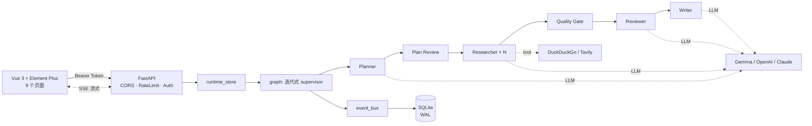

<div align="center">

# 🦉 Athena Pro

### 企业级多 Agent 深度研究助手

*把一个问题,变成一份带引用、可追溯、可下载的研究报告*

<br/>


<br/>

**多 Agent 流水线** · **真实 LLM (Gemma / OpenAI / Claude)** · **真实联网搜索** · **引用可验证** · **成本治理** · **一键部署**

</div>

---

## 💡 为什么做这个项目

学 AI Agent 的教程很多,但几乎都停在 **demo 级**:拉个框架、调个 API、跑通一个 "Hello World" 就结束了。

可一旦要在企业里**真落地**,你会发现没人教这些:

| 教程不教的 | Athena Pro 怎么做 |
|---|---|
| ❌ 任务跑一半进程挂了,数据全丢 | ✅ SQLite 持久化 + 重启自动恢复 |
| ❌ 烧了多少 token、每个节点多少钱,一笔糊涂账 | ✅ Token 级成本看板,精确到 agent 节点 |
| ❌ 报告里的引用是真的吗?能核验吗 | ✅ 引用逐条人工验证(通过 / 驳回 / 复核) |
| ❌ 研究计划要不要人审一道 | ✅ Plan Review 人审环节,可改可驳回 |
| ❌ 怎么部署上线 | ✅ `docker compose up` 一键起 |

> **Athena Pro 把"教程不教的企业级部分"完整实现了一遍。** 从 *能跑* 到 *能用*。

---

## 🎬 一分钟了解

```
输入一个研究问题
      │
      ▼
 Planner 拆题  →  Researcher 并发检索  →  Quality Gate 评分
      │                                        │
      │              ┌── 不达标 ──  Reviewer 补充调研 ◄┘
      ▼              ▼
 Writer 撰写  →  带 [n] 引用的 Markdown 报告  →  导出 PDF / DOCX / MD
```

---

## ✨ 核心能力

### 🤖 多 Agent 迭代流水线
`Planner → Plan Review → Supervisor → Researcher(并发) → Quality Gate → Reviewer → Writer`
质量不达标时,Supervisor 自动追加调研轮次,而不是直接交一份半成品。

### 🧠 真实 LLM,不是 Mock
- 自托管 **Gemma**(vLLM,数据不出网)/ **OpenAI** / **Anthropic** / **DeepSeek** / **OpenRouter**
- 各节点可独立指定模型(planner 用强模型,researcher 用快模型)

### 🔍 真实联网搜索
- **DuckDuckGo**(零配置,开箱即用)/ **Tavily**(配 key 自动启用)
- 带重试、缓存、多引擎兜底 —— 报告里的每个 URL 都真实可访问

### 📊 9 个企业级页面
研究工作台 · 计划审查 · 引用验证 · 报告与引用 · 知识库 · 成本看板 · 运行历史 · 用量仪表盘 · 系统设置

### 🛡️ 生产级基建
SQLite 持久化 · SSE 流式 · API Key 鉴权 · 限流 · 重启恢复 · 健康检查

---

## 🏗️ 架构



---

## 🚀 快速开始

### 方式一:Docker(推荐)

```bash
git clone https://github.com/malevrigns/Athena-Pro.git
cd Athena-Pro
cp .env.example .env          # 按需填写 LLM / 搜索配置
docker compose up -d --build
```

打开 **http://localhost:5173** 即可使用。

### 方式二:本地开发

```bash
# ---- 后端 ----
python -m venv .venv && source .venv/bin/activate
pip install -e ".[all]"
cp .env.example .env
python -m uvicorn athena.api.main:app --reload --port 8000

# ---- 前端 ----
cd web
npm install
npm run dev
```

> 不配置任何 API key 时,默认走 mock LLM + mock 搜索,开箱即可演示。

---

## ⚙️ 配置(`.env`)

```bash
# LLM:mock | openai | anthropic | deepseek | gemma
ATHENA_LLM_PROVIDER=gemma
ATHENA_DEFAULT_MODEL=gemma-4-31B-it
ATHENA_GEMMA_BASE_URL=http://your-vllm-host:8000/v1
ATHENA_GEMMA_API_KEY=EMPTY

# 搜索:mock | duckduckgo | tavily
ATHENA_SEARCH_PROVIDER=duckduckgo

# 鉴权
ATHENA_REQUIRE_AUTH=true
ATHENA_API_KEY=换成一个长随机串
```

完整变量见 [`.env.example`](.env.example)。

---

## 🧱 技术栈

| 层 | 技术 |
|---|---|
| 后端 | FastAPI · SQLite(WAL)· httpx · SSE · structlog |
| Agent | 迭代式 supervisor 流水线 · LLM 路由 · 搜索 tool |
| 前端 | Vue 3 · Element Plus · Vue Flow · ECharts · anime.js · markdown-it |
| 部署 | Docker Compose · Nginx |

---

## 🗺️ 路线图

- [x] 多 Agent 迭代流水线 + 真实 LLM / 搜索
- [x] 引用验证 · 成本看板 · 知识库 CRUD
- [x] 报告导出 PDF / DOCX / Markdown
- [ ] 文件 / 知识库向量检索(pgvector / Qdrant)
- [ ] 多用户与 RBAC
- [ ] MCP 工具市场接入

---

<div align="center">

**Athena Pro** —— 教学型项目,但每一处都按生产标准实现。

⭐ 如果它帮你理解了"企业级 Agent 该怎么做",欢迎 Star

</div>
